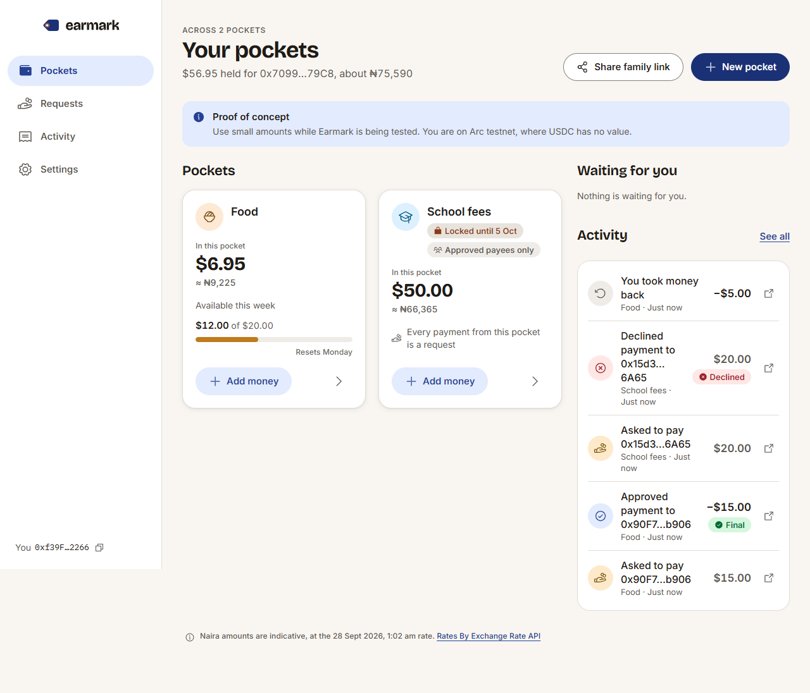
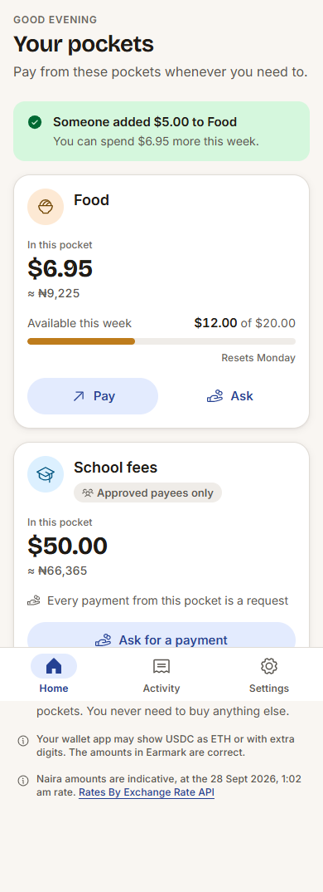
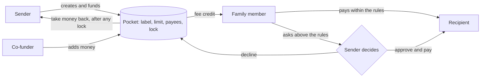

# Earmark

**Purpose-bound USDC pockets for money sent home, settled on Arc.**

<p>
  
  
</p>

<sub>Screenshots from the local rehearsal (`web/e2e/rehearsal.mjs`). Mainnet screenshots replace them at launch.</sub>

## Live

| | |
| --- | --- |
| App | _Mainnet link added at launch (Phase 7)_ |
| Contract on Arc mainnet | _Address and explorer link added at launch_ |
| Demo pockets | _Three public pocket pages added at launch_ |
| Arc testnet deployment | _`deployments/arc-testnet.json` after the testnet deploy_ |

Reviewers can open any public pocket page (`/#/view/<id>`) with no wallet.

## The problem

People abroad send billions home every year: about $21.8 billion to Nigeria alone in 2025 (Vanguard, 2026), at close to 9% in fees on a $200 transfer to Sub-Saharan Africa (UN DESA, 2025). Once the money lands, the sender loses all say in how it is used. In a J-PAL field experiment, simply letting migrants label money for education raised what they sent by more than 15%, while paying the school directly added only 2.2% more (De Arcangelis et al., 2015).

Earmark turns that label into a rule enforced by software, following the Purpose Bound Money model of the Monetary Authority of Singapore (2023): the rules wrap standard USDC, and money that leaves a pocket is ordinary USDC.

## How Earmark uses Arc

- **One token.** Pockets hold USDC through Arc's ERC-20 interface (`0x3600…0000`), so no second token is involved anywhere.
- **A pocket pays its family member's fees.** On Arc, network fees are USDC. Each pocket tops up the family member's wallet with a few cents of the same USDC (the "fee credit"), so a first-time user never has to buy a gas token.
- **Final means final.** Deterministic finality means a spend is final by the time the sender sees it. The app treats the first receipt as Final, and a live feed shows it on the sender's screen within seconds.
- **Small allowances stay economical.** Fees are in dollars, and a spend within the rules costs about a fifth of a cent at today's base fee (`docs/GAS.md`).

## How it works



Money leaves a pocket in only three ways:

1. A spend within the rules, by the family member.
2. An approved request, paid in the same step.
3. The sender taking money back once any commitment lock has ended.

The rules:

- **Allowance.** Up to a limit per day, week or month (0 means every payment is a request). The period rolls forward on its own.
- **Approved payees only (optional).** Spends go only to listed addresses; anything else becomes a request.
- **Requests.** Any amount to any address, at most 20 waiting. Approving pays at once and does not use up the allowance.
- **Commitment lock (optional).** The sender cannot take money back before a date. The date can move later, never earlier.
- **Fee credit.** When the family member's USDC drops below half the float, the pocket tops it back up, within a per-period cap. Top-ups never count against the allowance.

Every event carries the block of the pocket's previous event. The app rebuilds a pocket's history by walking those pointers one block at a time: no indexer, no backend, and no wide log scans. That matters on Arc, where the public RPC refuses log queries spanning 10,000 blocks or more.

## Run it yourself

**Prerequisites:** Git, Node.js 22, [Foundry](https://getfoundry.sh), and (for static analysis) Slither.

```bash
git clone <repository> earmark && cd earmark
git submodule update --init --recursive

# Contract: 100 unit, fuzz and invariant tests; 100% line coverage
cd contracts
forge test
forge coverage --report summary
slither .

# Web app
cd ../web
cp .env.example .env.local   # then fill in the four values below
npm install
npm run dev                  # http://localhost:5173
npm test && npm run lint && npm run build
```

| Variable | Meaning |
| --- | --- |
| `VITE_NETWORK` | `arcTestnet` (5042002) or `arcMainnet` (5042) |
| `VITE_POCKETS_ADDRESS` | The EarmarkPockets address (see `deployments/`) |
| `VITE_DEPLOY_BLOCK` | The block it was deployed in |
| `VITE_RPC_URL` | `https://rpc.testnet.arc.io` or `https://rpc.mainnet.arc.io` |
| `VITE_DEMO_POCKET_ID` | Optional: a pocket shown on the landing page |

**Local end-to-end rehearsal.** Run `anvil --chain-id 5042002 --base-fee 20000000000`, then:

```bash
bash scripts/local-chain.sh > web/.env.local
cd web && npx vite --port 5173
node e2e/rehearsal.mjs
```

That deploys against a 6-decimal USDC placed at Arc's USDC address, then drives the real app in headless Chrome through PRD Section 11.3 with a test-only wallet. `docs/DEPLOY.md` has the testnet and mainnet commands.

## Security notes and known limitations

- **No privileged roles.** No owner, admin, pause, upgrade path, `delegatecall`, `selfdestruct`, `payable` function or `receive()`.
- **Safe writes.** Every write is `nonReentrant`, follows checks-effects-interactions, and moves USDC only through `SafeERC20`.
- **Deposits.** They're credited by the amount actually received.
- **Approvals.** The app asks for exact-amount USDC approvals only. It simulates every call before the wallet prompt, so a payment that would fail is explained and never sent.
- **Evidence.** 100 Foundry tests, including all seven invariants over 25,600 random calls. 100% line and branch coverage on `EarmarkPockets.sol`. Slither reports 0 high and 0 medium findings. Details are in `docs/SECURITY.md`.
- **Unaudited proof of concept.** Use small amounts.

Known limitations:

- USDC sent straight to the contract without `fund` is not credited to any pocket and cannot be recovered.
- Co-funders' deposits can be taken back by the pocket's creator. The app warns co-funders first.
- The contract cannot be paused or upgraded. A fix means a new contract, which is why the app advises small amounts.
- Addresses, amounts, labels and notes are public on Arc. Labels should stay generic ("School fees", not a child's name). Names people give each other stay in their own browser.

## Roadmap

1. **Easier onboarding.**
   - Passkey wallets for family members.
   - SMS or WhatsApp alerts for senders.
   - Request expiry.

   Gate: five families using Earmark without help.
2. **Easier funding.** App Kit on-ramp by card, and EURC or GBP senders through App Kit swaps. Gate: the first cross-currency funding.
3. **Real payees.** A registry of schools, landlords and traders that accept USDC or work with a local off-ramp. Gate: three institutions registered.
4. **Privacy and agents.** Adopt Arc's opt-in privacy when it ships, and allow an AI bill-pay agent as a spender under the same caps.
5. **Funding.** Apply to the Circle Grant Program with pilot data.

## Repository

| Path | What it holds |
| --- | --- |
| `contracts/` | `EarmarkPockets.sol`, tests (unit, fuzz, invariant), deploy and ABI scripts |
| `web/` | The app (Vite, React, TypeScript), its unit tests and the end-to-end rehearsal |
| `design-system/` | The Earmark design system the app is built from |
| `deployments/` | Addresses, receipts and blocks per network |
| `docs/` | PRD, decisions, friction log, security, gas, deploy, rehearsal, submission, demo script |

## References

Abdul Latif Jameel Poverty Action Lab. (n.d.). *Testing commitment devices for remittances among Filipino migrants in Rome*. Retrieved September 27, 2026, from https://www.povertyactionlab.org/evaluation/testing-commitment-devices-remittances-among-filipino-migrants-rome

Arc Network Services LLC. (n.d.-a). *Connect to Arc*. Arc Docs. Retrieved September 28, 2026, from https://docs.arc.io/arc/references/connect-to-arc

Arc Network Services LLC. (n.d.-b). *EVM differences*. Arc Docs. Retrieved September 28, 2026, from https://docs.arc.io/arc/references/evm-differences

Arc Network Services LLC. (n.d.-c). *Gas and fees*. Arc Docs. Retrieved September 28, 2026, from https://docs.arc.io/arc/references/gas-and-fees

circlefin. (n.d.). *[Issue #80 on eth_estimateGas failures for USDC write transactions]* [GitHub issue]. GitHub. https://github.com/circlefin/arc-node/issues/80

De Arcangelis, G., Joxhe, M., McKenzie, D., Tiongson, E., & Yang, D. (2015). Directing remittances to education with soft and hard commitments: Evidence from a lab-in-the-field experiment and new product take-up among Filipino migrants in Rome. *Journal of Economic Behavior & Organization, 111*, 197–208. https://doi.org/10.1016/j.jebo.2014.12.025

Monetary Authority of Singapore. (2023). *Purpose bound money (PBM) technical whitepaper*. https://www.mas.gov.sg/-/media/mas-media-library/development/fintech/pbm/pbm-technical-whitepaper.pdf

Team Arc. (2026, September 16). *The unfinished business of finance, machine commerce, and global money: A request for builders*. Arc. https://www.arc.io/blog/the-unfinished-business-of-finance-machine-commerce-and-global-money

United Nations Department of Economic and Social Affairs. (2025). *World economic situation and prospects: November 2025 briefing, no. 196*. https://policy.desa.un.org/publications/world-economic-situation-and-prospects-november-2025-briefing-no-196

Vanguard. (2026, May). *Diaspora remittances stabilises at $21.8bn in 2025 amid global pressures*. https://www.vanguardngr.com/2026/05/diaspora-remittances-stabilises-at-21-8bn-in-2025-amid-global-pressures/

## Licence

MIT. See `LICENSE`. Fonts are under the SIL Open Font License and Phosphor Icons under MIT (`web/public/fonts/licenses/`).
