<div align="center">

# Earmark

### Purpose-bound USDC pockets for money sent home, settled on Arc.

*Send money with a purpose. Keep a say in how it is used. Never take custody of anyone's funds.*

[](LICENSE)
[](contracts/src/EarmarkPockets.sol)
[-0b5fff.svg)](#arc-network-reference)
[-2775ca.svg)](#how-earmark-uses-arc)
[](web/)
[](#architecture)
[](#security)

<p>
  
  
</p>

<sub>Screenshots from the local rehearsal (`web/e2e/rehearsal.mjs`). Mainnet screenshots replace them at launch.</sub>

[Live status](#live-status) ·
[The problem](#the-problem) ·
[Features](#features) ·
[How it works](#how-it-works) ·
[Architecture](#architecture) ·
[Quick start](#quick-start) ·
[Security](#security) ·
[Roadmap](#roadmap) ·
[License](#license)

</div>

---

## Table of contents

1. [Overview](#overview)
2. [Live status](#live-status)
3. [The problem](#the-problem)
4. [Why Earmark is necessary](#why-earmark-is-necessary)
5. [Goals and non-goals](#goals-and-non-goals)
6. [Features](#features)
7. [Who uses Earmark](#who-uses-earmark)
8. [How it works](#how-it-works)
9. [How Earmark uses Arc](#how-earmark-uses-arc)
10. [Architecture](#architecture)
11. [Smart contract reference](#smart-contract-reference)
12. [Web app reference](#web-app-reference)
13. [Arc network reference](#arc-network-reference)
14. [Quick start](#quick-start)
15. [Configuration](#configuration)
16. [Testing and quality](#testing-and-quality)
17. [Deployment](#deployment)
18. [Security](#security)
19. [Privacy](#privacy)
20. [Gas and fees](#gas-and-fees)
21. [Sustainability](#sustainability)
22. [Roadmap](#roadmap)
23. [Repository layout](#repository-layout)
24. [Documentation index](#documentation-index)
25. [Contributing](#contributing)
26. [FAQ](#faq)
27. [Glossary](#glossary)
28. [Acknowledgements](#acknowledgements)
29. [References](#references)
30. [License](#license)

---

## Overview

**Earmark** lets people living abroad fund labelled USDC **pockets** (school fees, food, rent, medicine, an emergency fund) that a family member spends under rules the sender sets. It is one immutable Solidity contract on [Arc](https://docs.arc.io) and one static, mobile-first web app. There is no server, no database, no analytics and no custody: the chain is the only data store, and the contract has no owner who could move anyone's money.

In one sentence: **Earmark turns the label on a remittance into a rule enforced by software.**

| | |
| --- | --- |
| **For the sender** | Direct money to purposes, watch every payment appear within seconds, approve or decline anything above the rules, and commit money to school fees so even they cannot pull it back early. |
| **For the family member** | Pay from a simple screen showing what is available this week, ask for more with one tap, and never buy a separate fee token: the pocket tops up their fees in the same USDC. |
| **For a reviewer** | Open any public pocket page with no wallet, read the rules and the full history, and follow links to the explorer. |

Earmark follows the *Purpose Bound Money* model of the Monetary Authority of Singapore (2023): the rules wrap standard USDC, and money that leaves a pocket is ordinary USDC with no strings attached.

---

## Live status

| Item | Status |
| --- | --- |
| Arc testnet (chain 5042002) | **Deployed** at [`0x68C480758172bBC94858B98F6E5E356FA30e3080`](https://explorer.testnet.arc.io/address/0x68C480758172bBC94858B98F6E5E356FA30e3080), block 64,978,753, 1 Oct 2026. Details in [`deployments/arc-testnet.json`](deployments/arc-testnet.json). |
| Arc mainnet (chain 5042) | _Address and explorer link added at launch (Phase 7). No mainnet deployment is recorded in this repository yet._ |
| Hosted app | _Link added at launch_ |
| Demo pockets | _Three public pocket pages added at launch_ |
| Source verification | Planned through Sourcify, with the standard JSON input committed for anyone to rebuild the bytecode (see [Deployment](#deployment)). |

Reviewers can open any public pocket page (`/#/view/<id>`) with no wallet.

> **Proof of concept.** The contract is immutable and unaudited. Use small amounts.

---

## The problem

People abroad send billions home every year: about **$21.8 billion to Nigeria alone in 2025** (Vanguard, 2026), at close to **9% in fees on a $200 transfer to Sub-Saharan Africa** against a 3% Sustainable Development Goal target (UN DESA, 2025). Once the money lands, the sender loses all say in how it is used.

That loss of say has a measurable cost. In a J-PAL field experiment with Filipino migrants in Rome, simply letting migrants **label** money for education raised what they sent by **more than 15%** (708 against 615 euros of a possible 1,000), while paying the school directly added only 2.2% more (De Arcangelis et al., 2015). Senders want to send more when they can say what it is for. Today almost no tool lets them say it in a way that holds.

| Evidence | Figure | Source |
| --- | --- | --- |
| Remittances into Nigeria, 2025 | About $21.8 billion | Vanguard (2026) |
| Cost of sending $200 to Sub-Saharan Africa, Q1 2025 | Close to 9% (6.4% globally; SDG target 3%) | UN DESA (2025) |
| Effect of labelling money for education | More than 15% more sent; paying the school directly added 2.2% | De Arcangelis et al. (2015) |
| Regulatory precedent | Singapore's Purpose Bound Money wraps money with purpose logic without programming the money itself | MAS (2023) |
| Stated market demand | Circle's Request for Builders names local-market financial platforms and a "family personal office" | Team Arc (2026) |

### Where the money goes wrong today

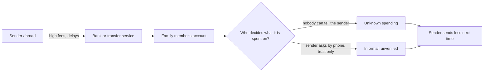

### The same flow with Earmark

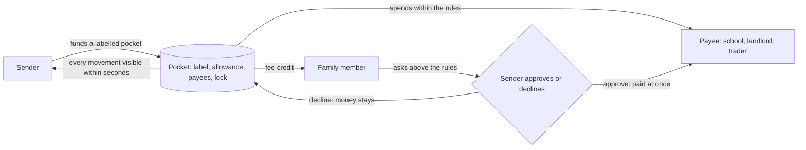

---

## Why Earmark is necessary

1. **Trust without surveillance.** Senders get visibility and a voice; family members keep dignity and a simple way to pay. Rules are explicit, not implied.
2. **Evidence-led.** The strongest lever in the research is the *label*, so labels are the core feature and the hard lock is optional.
3. **No intermediary to trust or pay.** Rules live in a contract that nobody, including the builder, can change or pause. There is no company that must stay solvent for a pocket to keep working.
4. **Dollar stability where it matters.** USDC lets a sender protect school fees or rent from local currency swings between sending and spending.
5. **Cheap enough for everyday amounts.** On Arc, a spend within the rules costs about a fifth of a cent at the current base fee ([Gas and fees](#gas-and-fees)), so a weekly allowance of a few dollars is economical.
6. **Usable by people with low crypto literacy.** The family experience avoids jargon, shows balances in plain words, and never asks the user to buy a second token for fees.
7. **Open and inspectable.** MIT licensed. Anyone can read the contract, rebuild the bytecode, run the tests and open a pocket's history.

---

## Goals and non-goals

### Goals

| ID | Goal | Done when |
| --- | --- | --- |
| G1 | A working product on Arc mainnet | Contract live on chain 5042, with real pockets and real transactions covering create, fund, spend, request, approve and withdraw |
| G2 | A complete, eligible submission | Live URL, public repository, description and builder profile submitted to Arc Microgrants |
| G3 | Technical credibility | Foundry unit, fuzz and invariant tests pass; Slither shows no high or medium findings; every Arc gotcha handled |
| G4 | Obvious Arc relevance | A self-funding fee credit, an instantly final live feed, and dollar-denominated fees |
| G5 | Near-zero cost | Only free tooling; mainnet spend under 0.25 USDC |

### Non-goals for this release

- No fiat on-ramp or off-ramp, no foreign exchange, no custody by the builder and no fees charged to users.
- No token, no governance, no AI agents.
- No native mobile app. The web app is mobile-first.
- No backend server or database. The chain is the only data store.

---

## Features

### Pockets and rules

| Feature | What it does |
| --- | --- |
| **Labelled pockets** | A pocket has a plain label (1 to 32 bytes), an icon (10 choices) and a colour (6 choices) so a family member recognises it at a glance. |
| **Allowance** | A limit per period (1 to 31 days, default 7). `0` makes every payment a request. The period rolls forward on its own, on the pocket's own grid. |
| **Approved payees (optional)** | Spending goes only to listed addresses (up to 10). Anything else becomes a request. |
| **Requests** | Any amount to any address, at most 20 waiting at once. Approving pays at once and does not use up the allowance. |
| **Commitment lock (optional)** | The sender cannot take money back before a chosen date (at most two years ahead). The date can move later, never earlier. |
| **Fee credit** | The pocket tops up the family member's wallet with a few cents of USDC when it runs low, within a per-period cap. Top-ups never count against the allowance. |
| **Co-funders** | Anyone can add money to a pocket (a brother in Houston, an aunt in Leeds). The app warns co-funders that the creator can take their money back. |
| **Adjustable rules** | After creation the sender can add or remove payees, change the allowance and extend the lock. The family member can withdraw their own pending request. |

### Money movement

| Feature | What it does |
| --- | --- |
| **Spend within the rules** | One step, final on confirmation. If the amount is too high the button becomes "Ask for approval" instead of failing. |
| **Approve or decline** | Approve pays the recipient in the same step. Decline leaves the money in the pocket. |
| **Withdraw** | The sender takes unspent money back at any time, except while a lock runs. The lock date is shown when it blocks. |
| **Exact-amount approvals** | USDC approvals cover exactly the amount being added, never an unlimited allowance. The step is skipped only when the current allowance already covers it. |
| **Simulate before sending** | Every call is simulated before the wallet prompt, so a payment that would fail is explained and never sent. |

### Visibility

| Feature | What it does |
| --- | --- |
| **Live activity feed** | Every pocket event, ordered by block, appears within seconds on the sender's screen. No indexer is involved. |
| **Public pocket page** | `/#/view/:id` shows balance, rules and history with no wallet connected. |
| **Share links** | A family link (`<origin>/#/family`) and a public link (`<origin>/#/view/:id`). |
| **Indicative naira amounts** | A naira figure appears beside USDC amounts, marked indicative with its time. If the rate service is down, the figures disappear and nothing else breaks. |
| **Nicknames** | People can name addresses ("Mama", "St Mary's School"). Nicknames live only in the user's own browser, never on-chain. |

### Experience and quality

| Feature | What it does |
| --- | --- |
| **Mobile-first** | Designed at 360 px wide, tap targets of at least 44 px, one primary action per screen. |
| **Light and dark themes** | Both pass automated accessibility checks. |
| **Accessible** | WCAG 2.2 AA colour contrast, every input labelled, status never shown by colour alone, keyboard navigation. |
| **Plain words** | The interface avoids "gas", "transaction", "hash", "mainnet", "sponsor" and "spender". It says "Fee credit added", "Available this week", "Ask for more". |
| **One-tap network switch** | If the wallet is on another chain the app offers to add or switch to Arc. |
| **No injected wallet on a phone** | The app explains how to open Earmark inside the MetaMask, OKX or Bitget in-app browser and offers "Copy link". |
| **Installable** | A web app manifest and icons let it be added to a phone's home screen. |

### Feature status

| Priority | Feature | Status |
| --- | --- | --- |
| P0 | Create, fund, spend, request, approve, decline, withdraw, extend lock | Built and tested |
| P0 | Fee credit, activity feed, public page, naira display, network switch | Built and tested |
| P0 | Contract: `setPayee`, `setLimit`, `cancelRequest` | In the contract (approved exception); their screens wait for product-owner approval |
| P1 | Payee and limit editing screens, cancel-request screen, QR code, CSV export | Not started |
| Later | See [Roadmap](#roadmap) | Planned |

---

## Who uses Earmark

| Role | Example | What they need | What they do in Earmark |
| --- | --- | --- | --- |
| **Sender** (sponsor) | A nurse in Manchester supporting her mother | Direct money to purposes, see every spend, approve large items, protect school fees from impulse withdrawals | Create pockets, fund, set rules, approve or decline, withdraw, extend a lock |
| **Family member** (spender) | A mother in Ilorin on a mid-range Android phone | Pay simply, never get stuck on fees, see balances in naira, ask for more | Spend within the rules, request above them |
| **Co-funder** | A brother in Houston | Top up the same pocket and see where it goes | Fund |
| **Payee** | A school bursar, a landlord, a trader, or an exchange deposit address for cash-out | Receive USDC that is final at once | Receive only |
| **Reviewer** | A grant judge | Confirm in minutes that it runs on Arc and uses it properly | Open the app, a public pocket page and explorer links, with no wallet |

Design constraints taken from the family member: low crypto literacy, small screens (360 px wide), patchy mobile data, and no appetite for seed-phrase jargon.

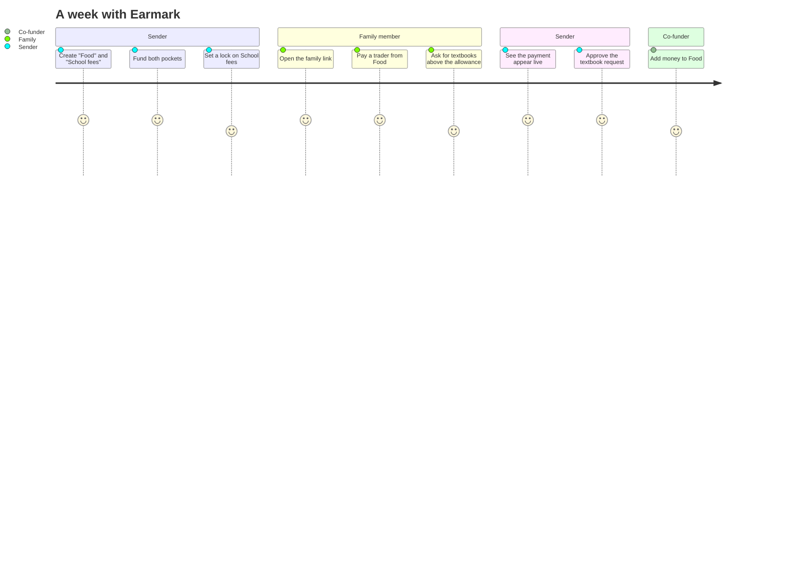

---

## How it works

### The big picture

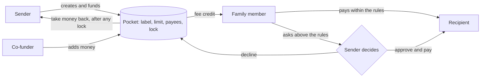

Money leaves a pocket in only **three** ways:

1. A **spend** within the rules, by the family member.
2. An **approved request**, paid in the same step.
3. The sender **taking money back** once any commitment lock has ended.

(A fourth, small flow also exists: the **fee credit** top-up goes only to the pocket's own family member, capped per period.)

### The rules

| Rule | Behaviour |
| --- | --- |
| **Allowance** | Up to a limit per day, week or month (1 to 31 days). `0` means every payment is a request. The period rolls forward on its own. |
| **Approved payees only** | When on, spends go only to listed addresses. Anything else must be a request. |
| **Requests** | Any amount to any address. At most 20 can wait. Approving pays at once and does not use up the allowance. |
| **Commitment lock** | The sender cannot withdraw before the lock date. It can be moved later, never earlier, and never more than two years ahead. |
| **Fee credit** | When the family member's USDC drops below half the target, the pocket tops it back up, within a per-period cap. Top-ups never count against the allowance. |

### What happens when the family member pays

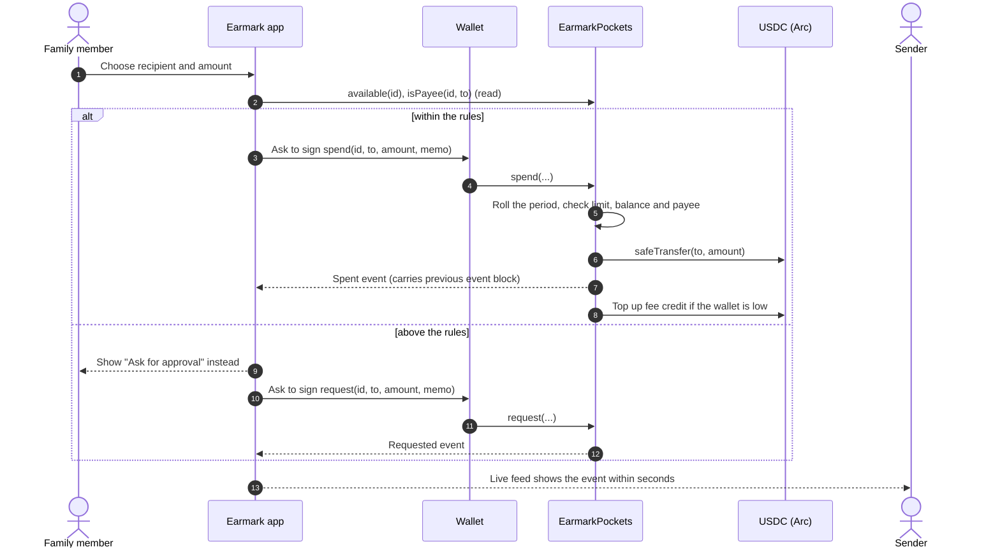

### The decision a spend goes through

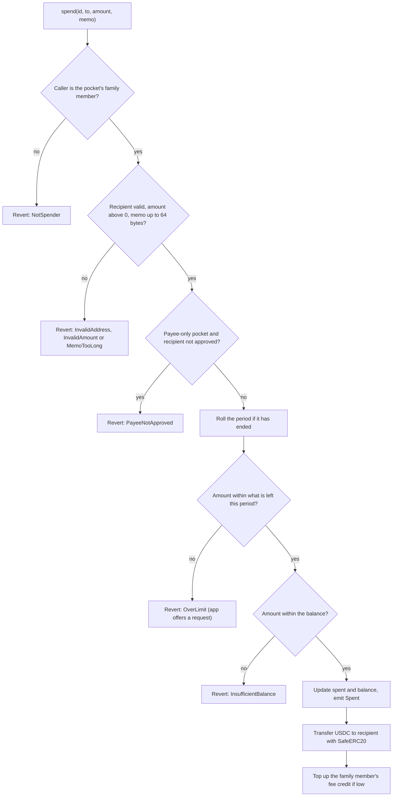

### Request lifecycle

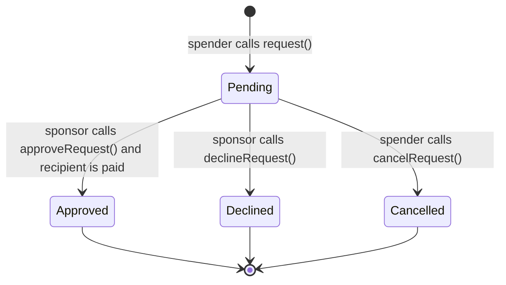

A request leaves `Pending` at most once.

### The period roll

The allowance applies per period. When a period has ended, the next write moves the start forward by *whole periods* and resets both counters. `available(id)` applies the same roll virtually, so the screen is always right without sending anything.

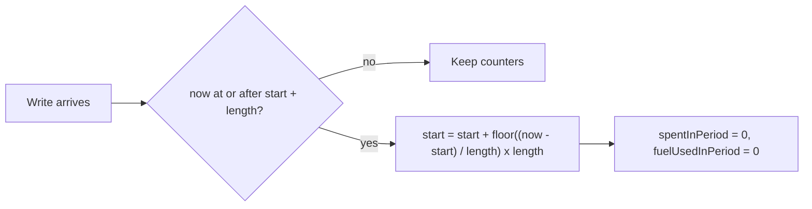

### Fee credit (self-funding fees)

On Arc, network fees are paid in USDC. A first-time family member would normally need to acquire USDC just to make a payment. Earmark removes that step.

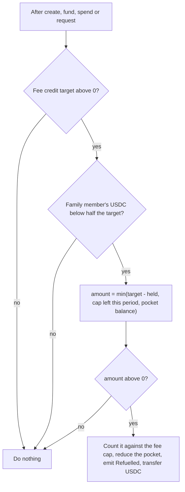

### Live activity feed with no indexer

Every pocket event after creation carries `prevEventBlock`, the block of the pocket's previous event. The app rebuilds a pocket's history by walking those pointers one block at a time. No indexer, no backend, and no wide log scans. That matters on Arc, where the public RPC refuses log queries that span 10,000 blocks or more.

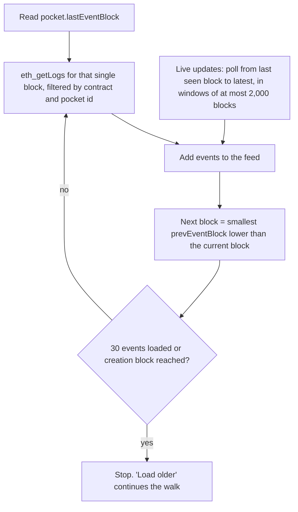

Two events in the same block are handled and tested. The feed orders by block number and log index, never by timestamp, because Arc timestamps are non-decreasing but not strictly increasing.

### Who may do what

| Action | Sender (sponsor) | Family member (spender) | Anyone |
| --- | :---: | :---: | :---: |
| `createPocket` | | | yes (caller becomes sponsor) |
| `fund` | | | yes |
| `spend` | | yes | |
| `request` | | yes | |
| `cancelRequest` | | yes | |
| `approveRequest` / `declineRequest` | yes | | |
| `withdraw` | yes (not while locked) | | |
| `extendLock` | yes (later only) | | |
| `setPayee` / `setLimit` | yes | | |
| Read functions | | | yes |

---

## How Earmark uses Arc

Earmark is built around three things that only make sense on Arc.

| Arc property | How Earmark uses it |
| --- | --- |
| **One token.** Pockets hold USDC through Arc's 6-decimal ERC-20 interface (`0x3600…0000`). | No second token appears anywhere. The contract never reads `msg.value`. |
| **Fees are paid in USDC.** | Each pocket tops up the family member's wallet with a few cents of the same USDC (the "fee credit"), so a first-time user never has to buy a fee token. |
| **Deterministic finality.** | A spend is final by the time the sender sees it. The app treats the first receipt as "Final", and a live feed shows it on the sender's screen within seconds. |
| **Dollar-denominated, low fees.** | A spend within the rules costs about a fifth of a cent at today's base fee ([Gas and fees](#gas-and-fees)), which keeps small allowances economical. |

How the platform's quirks are handled is in [Arc network reference](#arc-network-reference), and every snag hit during the build is recorded in [`docs/FRICTION-LOG.md`](docs/FRICTION-LOG.md).

---

## Architecture

Earmark is a static single-page app that reads and writes Arc directly through the user's wallet and the public RPC. Hosting is free and there is nothing to run.

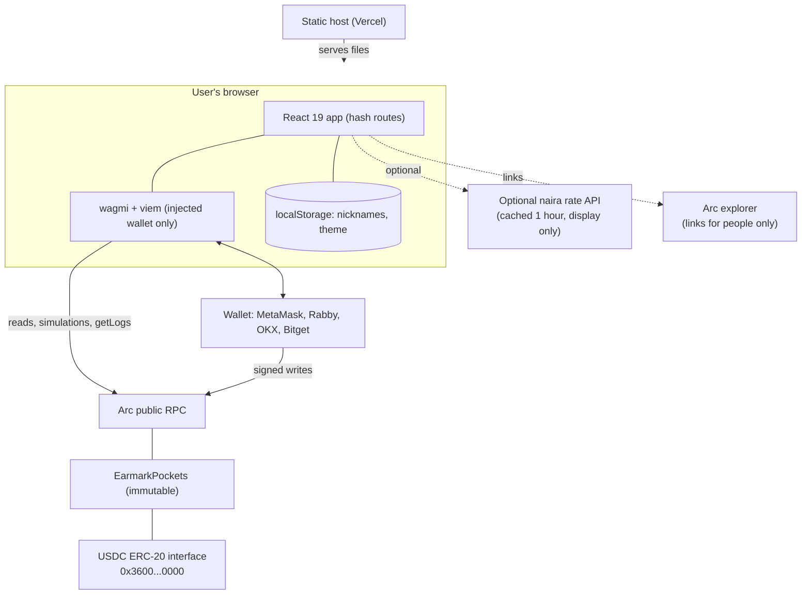

### Design principles

| Principle | In practice |
| --- | --- |
| **The chain is the database** | No backend, no indexer. History comes from per-pocket back-pointers. |
| **Money is `bigint`** | USDC stays a `bigint` with 6 decimals until the component boundary. `formatUnits(value, 6)` is used only for display. The 18-decimal native balance is never read. |
| **Immutable contract** | No owner, admin, pause, upgrade, `delegatecall`, `selfdestruct`, `payable` function or `receive()`. |
| **Checks, effects, interactions** | Every write is `nonReentrant`, updates state and emits events before transfers, and moves USDC only through `SafeERC20`. |
| **Fail clearly** | Every contract error maps to one plain sentence. Unreachable RPC, wrong network and missing naira rate each have a defined state. |
| **No tracking** | No analytics, cookies or trackers. The app talks only to itself, the Arc RPC, and the optional rate API. |
| **One source of copy** | All user-facing text lives in `web/src/copy.ts`, so translations can follow. |

---

## Smart contract reference

`contracts/src/EarmarkPockets.sol`. Solidity **0.8.28**, optimizer on (200 runs), EVM version **cancun**, OpenZeppelin Contracts 5.x (`SafeERC20`, `SafeCast`, `ReentrancyGuard`). MIT licensed.

**Constructor:** `constructor(IERC20Metadata usdc_)` stores USDC as an immutable and reverts with `BadToken()` unless `usdc_.decimals() == 6`. On Arc it is deployed with `0x3600000000000000000000000000000000000000`. The deploy script refuses non-Arc chains and any USDC address other than that one.

### Data model

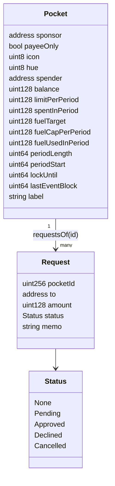

Amounts are USDC base units (6 decimals). Ids for pockets and requests start at 1.

### Write functions

| Function | Caller | Checks | Effects |
| --- | --- | --- | --- |
| `createPocket(CreateParams p, address[] payees) returns (uint256)` | Anyone; becomes sponsor | Spender and payees valid; label 1 to 32 bytes; period 1 to 31 days; lock zero or in the future and at most 730 days ahead; fee credit within bounds; `icon < 10`, `hue < 6`; at most 10 payees | Stores the pocket; pulls the deposit and credits the amount actually received; sets payees; first fee-credit top-up |
| `fund(id, amount)` | Anyone | Pocket exists; amount above 0 | Pulls USDC; credits what arrived; rolls the period; tops up the family member |
| `spend(id, to, amount, memo)` | Spender | Valid recipient; approved payee if payee-only; amount within what is left this period and the balance; memo at most 64 bytes | Updates counters and balance, transfers, then tops up the family member |
| `request(id, to, amount, memo)` | Spender | Valid recipient (any payee allowed); amount above 0; fewer than 20 pending | Stores a pending request; tops up the family member |
| `approveRequest(requestId)` | Sponsor | Status pending; amount within the balance | Marks approved, reduces the balance, pays the recipient. Does not touch the period limit |
| `declineRequest(requestId)` | Sponsor | Status pending | Marks declined; money stays |
| `cancelRequest(requestId)` | Spender | Status pending | Marks cancelled |
| `withdraw(id, amount, to)` | Sponsor | Not before `lockUntil`; amount within the balance; valid recipient | Reduces the balance and transfers |
| `extendLock(id, newLock)` | Sponsor | Later than the current lock, in the future, at most 730 days ahead | Updates `lockUntil` |
| `setPayee(id, payee, allowed)` | Sponsor | Valid address; at most 10 active payees | Updates the payee flag and list; no-op if unchanged |
| `setLimit(id, limit)` | Sponsor | Sponsor only | Rolls the period, updates the limit. Spending so far this period still counts |

A valid recipient is never the zero address and never the contract itself.

### Read functions

`getPocket(id)`, `available(id)`, `payeesOf(id)`, `isPayee(id, addr)`, `pocketsOfSponsor(addr)`, `pocketsOfSpender(addr)`, `requestsOf(id)`, `getRequest(requestId)`, `pendingCount(id)`, and the public `usdc`, `pocketCount` and `requestCount`.

`available(id)` is the smaller of *what is left this period after a virtual roll* and *the balance*, and `0` for request-only pockets.

### Limits

| Constant | Value |
| --- | --- |
| `MAX_LABEL_BYTES` | 32 |
| `MAX_MEMO_BYTES` | 64 |
| `MIN_PERIOD` / `MAX_PERIOD` | 1 day / 31 days |
| `MAX_LOCK_AHEAD` | 730 days |
| `MAX_FUEL_TARGET` (fee credit float) | 500,000 (0.50 USDC) |
| `MAX_FUEL_CAP` (fee credit cap per period) | 1,000,000 (1.00 USDC) |
| `MAX_PAYEES` | 10 |
| `MAX_PENDING` | 20 |
| `ICON_COUNT` / `HUE_COUNT` | 10 / 6 |

Icons: graduation-cap, bowl-food, house-line, first-aid-kit, lightning, device-mobile, bus, shopping-bag, hand-heart, piggy-bank. Hues: palm, sky, clay, teal, plum, olive.

### Events

Every event after `PocketCreated` carries `prevEventBlock`.

| Event | Emitted when |
| --- | --- |
| `PocketCreated` (pocketId, sponsor, spender, label, limitPerPeriod, periodLength, lockUntil, payeeOnly, icon, hue) | A pocket is created |
| `Funded` (pocketId, from, amount, prevEventBlock) | Money is added |
| `Spent` (pocketId, to, amount, memo, prevEventBlock) | A spend within the rules |
| `Requested` (pocketId, requestId, to, amount, memo, prevEventBlock) | A request is made |
| `Approved` / `Declined` / `Cancelled` (pocketId, requestId, prevEventBlock) | A request is handled |
| `Withdrawn` (pocketId, to, amount, prevEventBlock) | The sponsor takes money back |
| `Refuelled` (pocketId, spender, amount, prevEventBlock) | The family member's fee credit is topped up |
| `LockExtended` (pocketId, lockUntil, prevEventBlock) | The lock moves later |
| `PayeeSet` (pocketId, payee, allowed, prevEventBlock) | A payee is added or removed |
| `LimitChanged` (pocketId, limitPerPeriod, prevEventBlock) | The allowance changes |

### Custom errors

| Error | Meaning |
| --- | --- |
| `NotSponsor` / `NotSpender` | The caller is not allowed to do that on this pocket |
| `UnknownPocket` | No such pocket |
| `InvalidAddress` / `InvalidAmount` | Zero address, the contract itself, or a zero amount |
| `BadLabel` / `MemoTooLong` | Label not 1 to 32 bytes; memo over 64 bytes |
| `BadPeriod` / `BadLock` / `LockNotExtended` | Period outside 1 to 31 days; lock in the past or too far ahead; lock not moved later |
| `Locked(until)` | Withdrawal attempted before the lock date |
| `OverLimit(available)` / `InsufficientBalance(balance)` | Spend above what is available or held |
| `PayeeNotApproved` / `TooManyPayees` / `TooManyPending` | Payee-only rule, payee cap or pending-request cap |
| `NotPending` | The request was already handled, or never existed |
| `FuelOutOfRange` / `BadAppearance` / `BadToken` | Fee credit above limits; icon or hue out of range; token is not 6-decimal |

### Invariants

Checked after every call of 256 random sequences of 100 calls each (25,600 calls):

1. USDC held by the contract is at least the sum of all pocket balances.
2. `spentInPeriod` never exceeds `limitPerPeriod` through spending. (After a sponsor lowers the limit mid-period it can sit above the new limit; nothing more can be spent until the next period.)
3. `fuelUsedInPeriod` never exceeds `fuelCapPerPeriod`.
4. No withdrawal succeeds before the lock date.
5. `lockUntil` never decreases.
6. Only the spender can spend, request or cancel; only the sponsor can approve, decline, withdraw, move the lock, or change payees or the limit.
7. A request leaves `Pending` at most once, and each pocket's pending count matches its pending requests.

---

## Web app reference

Vite, React 19, TypeScript (strict), wagmi 3 with viem 2 (injected wallet only, so no WalletConnect project ID is needed), TanStack Query. Plain CSS built on design-system tokens.

### Routes

All routes are hash routes, so the app runs on any static host with no server rewrites.

| Route | Screen | Who |
| --- | --- | --- |
| `/#/` | Landing | Everyone |
| `/#/send` | Sender dashboard: pocket cards, balances, allowance meters, live feed | Sender |
| `/#/requests` | Requests waiting for approval | Sender |
| `/#/activity` | Full activity feed | Sender |
| `/#/new` | New pocket form with a two-step progress (approve, then create) | Sender |
| `/#/p/:id` | Pocket detail: rules, fund, withdraw, requests, feed | Sender |
| `/#/family` | Family home: "Available this week", Pay and Ask | Family member |
| `/#/family/activity` | Family activity | Family member |
| `/#/view/:id` | Public read-only pocket page, no wallet needed | Anyone |
| `/#/settings` | Nicknames, theme, links | Everyone |

Navigation: the sender sees Pockets, Requests (with a pending count), Activity and Settings. The family member sees Home, Activity and Settings. A wallet that can only spend lands on `/#/family`; others land on `/#/send`.

### Every write has three states

*Waiting for wallet*, *Submitted*, *Final* (with an explorer link). Errors are mapped to one plain sentence each.

### Source layout

| Path | Purpose |
| --- | --- |
| `web/src/chains.ts`, `config.ts` | Arc chain definitions and environment configuration, with an error screen for bad config |
| `web/src/abi.ts` | Contract ABI, exported from the Foundry build |
| `web/src/copy.ts` | All user-facing text, checked against the word list by a test |
| `web/src/lib/amounts.ts` | 6-decimal USDC parse and format with no floating-point maths |
| `web/src/lib/tx.ts`, `gas.ts` | The write wrapper: fee policy, gas estimate plus 20%, fallbacks, simulation, three states |
| `web/src/lib/errors.ts` | Contract error to plain sentence |
| `web/src/lib/activity.ts` | The back-pointer walk and the live poll |
| `web/src/lib/rates.ts` | Cached naira rate; hides figures on failure |
| `web/src/lib/` (others) | Router, dates, names, theme, storage, toasts, viewport, RPC retry |
| `web/src/data/` | Reads (batched through Multicall3), live feed, hooks |
| `web/src/pages/`, `components/` | Screens and reusable pieces |
| `web/src/ds/` | Copied design-system source |
| `web/src/styles/` | Tokens, design-system CSS, app CSS, motion |

### Design system

The `design-system/` folder holds the Earmark design system the app is built from: tokens, the `ek-` component classes, type styles (`.ek-type-*`), content guidelines, responsive rules, patterns and accessibility rules. The app uses only those tokens and classes. There is no Tailwind, no other UI kit or icon set, and no hard-coded colours or font sizes. Icons are Phosphor (MIT); fonts are under the SIL Open Font License (`web/public/fonts/licenses/`).

---

## Arc network reference

| Item | Mainnet | Testnet |
| --- | --- | --- |
| Chain ID | 5042 (`0x13B2`) | 5042002 (`0x4CEF52`) |
| RPC | `https://rpc.mainnet.arc.io` | `https://rpc.testnet.arc.io` |
| Explorer | https://explorer.arc.io | https://explorer.testnet.arc.io |
| Native currency | USDC, 18 decimals | USDC, 18 decimals |
| USDC ERC-20 interface | `0x3600000000000000000000000000000000000000` (6 decimals) | Same address |
| Minimum `maxFeePerGas` | 20 gwei | 20 gwei |
| Faucet | None (real USDC) | https://faucet.circle.com |

Values from the Arc documentation, verified 27 and 28 September 2026. Confirm with `cast chain-id` before each deploy.

### Arc requirements and how Earmark meets them

| ID | Arc fact | Earmark's answer |
| --- | --- | --- |
| A1 | USDC is the native fee token. Native balances use 18 decimals; the ERC-20 interface uses 6; both share one balance | Contract and app use only the ERC-20 interface with 6 decimals. Never read `msg.value`. Never mix the two in maths (raw values differ by 10^12) |
| A2 | Transactions with `maxFeePerGas` below 20 gwei are silently dropped | Every write sets a 1 gwei priority fee and `maxFeePerGas` = max(25 gwei, 2 x latest base fee + 1 gwei), in the app and in Foundry scripts alike |
| A3 | `eth_estimateGas` has been reported to fail for USDC writes ([arc-node #80](https://github.com/circlefin/arc-node/issues/80)) | Estimate plus 20%; on failure use fixed fallback limits |
| A4 | Finality is deterministic and instant | First receipt is treated as final and labelled "Final" |
| A5 | Block timestamps are non-decreasing, not strictly increasing | The feed orders by block and log index. Timestamps are used only for day-scale periods and locks |
| A6 | Transfers to or from a blocklisted address revert and still cost fees | Recipients are validated; a compliance block is explained in plain words |
| A7 | USDC movements emit extra system Transfer logs that can double count in generic indexers | The feed reads only Earmark's own events |
| A8 | The explorer API sits behind a Cloudflare challenge | All data comes from the RPC. The explorer is used only for human links |
| A9 | `PREVRANDAO` always returns 0 | Earmark uses no randomness |
| A10 | Standard `anvil` is not Arc's EVM | Unit tests use a 6-decimal mock USDC; real behaviour is confirmed on Arc testnet before mainnet |
| A11 | Some wallets show the USDC balance as "ETH" or with wrong decimals | The app shows its own correct USDC figures and says not to rely on the wallet's display |

### Other measured facts (see [`docs/FRICTION-LOG.md`](docs/FRICTION-LOG.md))

- `eth_getLogs` rejects spans of 10,000 blocks or more (`-32012`). Earmark never scans ranges and chunks any scan to 2,000 blocks.
- Load-balanced backends can lag. `-32014 requested data not available` is treated as retryable.
- Multicall3 is deployed on both networks, so reads are batched to cut round trips on slow mobile data.
- Blockscout verification is behind Cloudflare. Sourcify is the working path.
- The public RPC sets a Cloudflare cookie; Earmark sends cross-origin requests without credentials and the network check found no cookies set by the app.

---

## Quick start

### Prerequisites

| Tool | Why |
| --- | --- |
| Git | Clone, including submodules (`forge-std`, OpenZeppelin) |
| Node.js 22 | Web app |
| [Foundry](https://getfoundry.sh) (`forge`, `cast`, `anvil`) | Contract build, tests, deploy |
| Slither (optional) | Static analysis |
| A browser wallet | MetaMask, Rabby, OKX or Bitget, for real use |

### Clone, test and run

```bash
git clone https://github.com/adamstosho/earmark.git earmark && cd earmark
git submodule update --init --recursive

# Contract: unit, fuzz and invariant tests, coverage, static analysis
cd contracts
forge build
forge test
forge coverage --report summary
slither .

# Web app
cd ../web
cp .env.example .env.local   # the example already points at the Arc testnet deployment
npm install
npm run dev                  # http://localhost:5173
npm run typecheck && npm run lint && npm test && npm run build
```

### Command reference

| Where | Command | Purpose |
| --- | --- | --- |
| `contracts/` | `forge build` | Compile |
| `contracts/` | `forge test -vvv` | Unit, fuzz and invariant tests |
| `contracts/` | `forge coverage --report summary` | Coverage |
| `contracts/` | `forge test --gas-report` | Gas report |
| `contracts/` | `slither .` | Static analysis |
| `web/` | `npm run dev` | Dev server |
| `web/` | `npm run typecheck` | TypeScript strict check |
| `web/` | `npm run lint` | ESLint (strict, type-checked) |
| `web/` | `npm test` | Vitest |
| `web/` | `npm run build` | Type check and production build |
| `web/` | `npm run preview` | Preview the build |
| `web/` | `npm run abi` | Re-export the ABI from the Foundry build |

### Local end-to-end rehearsal

Runs the real app in headless Chrome against a local chain, with a test-only wallet.

```bash
anvil --chain-id 5042002 --base-fee 20000000000
bash scripts/local-chain.sh > web/.env.local
cd web && npx vite --port 5173
node e2e/rehearsal.mjs
```

That deploys against a 6-decimal USDC placed at Arc's USDC address, then drives the app through the testnet rehearsal plan in [`docs/REHEARSAL.md`](docs/REHEARSAL.md). A local EVM cannot rehearse the fee credit (anvil charges fees in ETH, not in the family member's USDC), so that step is checked on Arc testnet.

---

## Configuration

Copy `web/.env.example` to `web/.env.local`. On Vercel, set the same names as environment variables.

| Variable | Required | Meaning |
| --- | :---: | --- |
| `VITE_NETWORK` | yes | `arcTestnet` (5042002) or `arcMainnet` (5042) |
| `VITE_POCKETS_ADDRESS` | yes | The `EarmarkPockets` address (see `deployments/`) |
| `VITE_DEPLOY_BLOCK` | yes | The block it was deployed in |
| `VITE_RPC_URL` | yes | `https://rpc.testnet.arc.io` or `https://rpc.mainnet.arc.io` |
| `VITE_DEMO_POCKET_ID` | no | A pocket shown as "See a live pocket" on the landing page. Leave empty to hide it |
| `VITE_SITE_URL` | no | The live address, no trailing slash. Adds the canonical link, share image and `sitemap.xml` at build time |

For contract deploys, `contracts/.env` holds `PRIVATE_KEY` and `USDC` (never committed; `contracts/.env.example` has placeholders only). An encrypted Foundry keystore is the recommended alternative.

---

## Testing and quality

| Layer | What is checked | Where |
| --- | --- | --- |
| **Unit tests** | Constructor, create, fund, spend, requests, withdraw and lock, fee credit, native value, reentrancy, event back-pointers (including two events in one block), views | `contracts/test/EarmarkPockets.t.sol` |
| **Fuzz tests** | Limits per period, balance reconciliation, `available`, lock window and monotonicity, fee credit formula | `contracts/test/EarmarkPockets.fuzz.t.sol` |
| **Invariant tests** | The seven invariants over 25,600 random calls with authorised and unauthorised callers, time jumps, payee and limit changes, cancellations | `contracts/test/invariant/` |
| **Mock tokens** | 6-decimal USDC, fee-taking, no-op, blocklisting, 18-decimal and re-entering tokens | `contracts/test/mocks/` |
| **Gas worst cases** | Worst-case gas per write, used to set the app's fallback limits | `contracts/test/GasWorstCase.t.sol` |
| **Web unit tests** | Amounts, activity walk and poll, every contract error, the copy word list, rates, fees, dates, config | `web/src/**/*.test.ts` |
| **End-to-end** | Headless-Chrome rehearsal of the testnet plan, multi-wallet flows, click-through sweep, Arc testnet read-only smoke test, network check, accessibility scan, screenshots | `web/e2e/` |

### Results

Re-run on 3 Oct 2026:

| Check | Result |
| --- | --- |
| `forge test` | 104 tests passed, 0 failed |
| `forge coverage` on `EarmarkPockets.sol` | 100% lines (217/217), statements (272/272), branches (49/49) and functions (33/33) |
| `npm test` (Vitest) | 71 passed in 5 files |
| `npm run typecheck` and `npm run lint` | No errors |
| `npm run build` | Succeeds. All JavaScript together is about 218 KB gzipped (budget: under 300 KB) |

Recorded earlier in the project documents (not re-run for this README):

| Check | Result | Recorded in |
| --- | --- | --- |
| Slither 0.11.6 | 0 high, 0 medium, 5 low (all `timestamp`, reviewed) | [`docs/SECURITY.md`](docs/SECURITY.md) |
| Lighthouse | Accessibility 100 and best practices 100 on landing and public pocket (budget: 90 or more) | [`docs/PROGRESS.md`](docs/PROGRESS.md) |
| axe-core | WCAG 2.2 AA, 0 violations on the main screens at 390 and 1280 px in both themes | [`docs/PROGRESS.md`](docs/PROGRESS.md) |
| Network check | Only the app, the Arc RPC and the rate API; no cookies | [`docs/PROGRESS.md`](docs/PROGRESS.md) |

Reproduce the first table with the commands in [Quick start](#quick-start).

### Quality bar

- TypeScript `strict`; no `any` in app code.
- No console errors or warnings.
- No placeholder text, TODOs, emoji or fake data in shipped screens. Demo data lives only in tests.
- Sources of truth in order: [`docs/DECISIONS.md`](docs/DECISIONS.md), [`docs/PRD.md`](docs/PRD.md), then `design-system/`.

---

## Deployment

The product owner runs every command that broadcasts. The full runbook, including Windows notes on keystore passwords, is in [`docs/DEPLOY.md`](docs/DEPLOY.md).

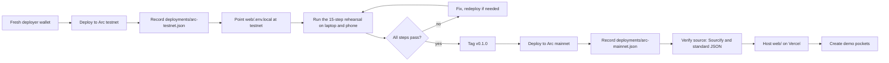

### Fee settings on every broadcast

`maxPriorityFeePerGas` = 1 gwei; `maxFeePerGas` = max(25 gwei, 2 x base fee + 1 gwei).

```bash
cd contracts
cast chain-id --rpc-url arc_testnet     # expect 5042002 (mainnet: 5042)
BASE=$(cast base-fee --rpc-url arc_testnet)
MAXFEE=$(( 2 * BASE + 1000000000 )); [ "$MAXFEE" -lt 25000000000 ] && MAXFEE=25000000000
forge script script/Deploy.s.sol:Deploy --rpc-url arc_testnet --broadcast \
  --account earmark-deployer --sender <DEPLOYER_ADDRESS> \
  --with-gas-price "$MAXFEE" --priority-gas-price 1gwei
```

### Hosting

Static hosting on Vercel: root directory `web`, framework Vite, production environment variables as in [Configuration](#configuration). No rewrites are needed because every route is a hash route. `web/vercel.json` sets security headers (`nosniff`, `Referrer-Policy`, `X-Frame-Options: DENY`, a restrictive `Permissions-Policy`) and long-lived caching for hashed assets and fonts.

### Source verification

Because the explorer's API is behind Cloudflare, verification goes through Sourcify. The standard JSON input is committed either way, so anyone can rebuild the bytecode with Solidity 0.8.28, 200 optimizer runs and `cancun`.

### Deployment record (Arc testnet)

| Field | Value |
| --- | --- |
| Contract | `0x68C480758172bBC94858B98F6E5E356FA30e3080` |
| Block | 64,978,753 |
| Date | 1 Oct 2026 |
| Gas used / effective price | 3,072,497 / 21 gwei |
| Fee paid | 0.064522437 USDC |
| Constructor USDC | `0x3600000000000000000000000000000000000000` |
| Receipt | [`0x88bd2769…034bb`](https://explorer.testnet.arc.io/tx/0x88bd2769fb7ad810bec842ab086f11b1e3d1a9968b8823a696493e7c60b034bb) |

It replaces the earlier 29 Sep 2026 testnet deployment.

---

## Security

Earmark is a **proof of concept**. The contract is immutable and unaudited. Use small amounts.

### Design

| Control | Detail |
| --- | --- |
| **No privileged roles** | No owner, admin, pause, upgrade path, `delegatecall` or `selfdestruct`. Nobody, including the builder, can move money except through the rules |
| **Three ways out** | A spend within the rules, an approved request, or a sponsor withdrawal after any lock. Fee credit goes only to the pocket's own family member, capped per period |
| **No native value** | No `payable` function and no `receive()` or `fallback()`. Native USDC sent to the contract reverts |
| **Reentrancy** | Every write is `nonReentrant`. State is updated and events emitted before each outgoing transfer. A test with a token that calls back into Earmark confirms the guard |
| **Safe transfers** | Every transfer uses `SafeERC20`. Deposits are credited by the amount actually received (tested with a fee-taking token) |
| **Exact approvals** | The app asks for an allowance of exactly the amount being added, never an unlimited one |
| **Recipients** | Never the zero address or the contract itself. A USDC compliance block makes the whole call revert and the app says so in plain words |
| **Simulation first** | The app simulates every call before the wallet prompt |
| **Secrets** | The builder never asks for, reads, prints or stores a private key or seed phrase. `.env` files, `out/`, `cache/`, `broadcast/` and `node_modules/` are never committed |

### Known limitations

| Limitation | Why and what to do |
| --- | --- |
| **USDC sent straight to the contract is lost** | USDC transferred without `fund` is not credited to any pocket and cannot be recovered, because there is no admin. Always add money through the app |
| **Co-funders' money belongs to the creator** | The sponsor can take back anything in the pocket once any lock ends. The app warns co-funders first |
| **No pause, no upgrade** | A fix means a new contract; pockets on the old one keep their rules. This is why the app advises small amounts |
| **Spender key compromise** | Whoever holds the family member's key can spend within the rules. The limit, payee list and lock bound the damage, and requests still need the sponsor |
| **Request history grows** | A pocket's request list grows for ever and `requestsOf` returns all of it. At most 20 can wait at once, which bounds pending work, not history |
| **Mock versus Arc USDC** | Local tests use a 6-decimal mock. Behaviour against Arc's own USDC is confirmed on Arc testnet before mainnet |
| **Public data** | See [Privacy](#privacy) |

### Reporting a vulnerability

Please do **not** open a public issue for a security problem. Use GitHub's private vulnerability reporting on the repository (Security tab, "Report a vulnerability") to reach the maintainers. Include the affected function or screen, steps to reproduce, and the impact you expect. Because the deployed contract is immutable, a confirmed contract bug is fixed by a new deployment and an updated README, and the app will say so.

Full detail, including the Slither triage, is in [`docs/SECURITY.md`](docs/SECURITY.md).

---

## Privacy

| Data | Where it lives | Public? |
| --- | --- | --- |
| Addresses, amounts, short labels, optional notes (memos, at most 64 bytes) | On-chain | **Yes**, readable by anyone on Arc |
| Nicknames you give an address | Your own browser (`localStorage`) only | No |
| Theme choice | Your own browser only | No |
| Names, phone numbers, personal data | Never collected | n/a |
| Analytics, cookies, trackers | None | n/a |

Keep labels generic ("School fees", not a child's name). The app warns that notes are public. Arc's opt-in privacy with view keys, now in development, is the upgrade path.

---

## Gas and fees

Arc charges network fees in USDC, and the base fee has sat at the 20 gwei floor in every block checked. Measured with Foundry 1.8.3 against the 6-decimal mock USDC on 28 to 30 Sep 2026 (Arc's own USDC interface may cost slightly more per transfer).

| Write | Typical execution gas | Approximate cost at 20 gwei plus a 1 gwei tip |
| --- | --- | --- |
| `spend` within the rules | about 69,000 plus 21,000 base | about $0.0019 |
| `fund` | about 73,000 plus 21,000 base | about $0.0020 |
| `createPocket` with 1 payee and a deposit | about 356,000 plus 21,000 base | about $0.0079 |

### Fee policy (every write, app and Foundry alike)

- `maxPriorityFeePerGas` = 1 gwei.
- `maxFeePerGas` = max(25 gwei, 2 x latest base fee + 1 gwei).
- The app estimates gas and adds 20%. If estimation fails, it uses fixed fallback limits derived from measured worst cases plus 30%, never below the PRD floors.

| Write | Worst case (gas) | Fallback limit used |
| --- | --- | --- |
| `approve` (USDC) | 73,358 | 100,000 |
| `createPocket` | 940,418 | 1,225,000 |
| `fund` | 131,828 | 175,000 |
| `spend` | 154,645 | 250,000 |
| `request` | 348,807 | 455,000 |
| `approveRequest` | 112,993 | 200,000 |
| `declineRequest` | 70,191 | 95,000 |
| `withdraw` | 99,459 | 130,000 |
| `extendLock` | 63,359 | 85,000 |
| `setPayee` | 125,319 | 165,000 |
| `setLimit` | 77,216 | 105,000 |
| `cancelRequest` | 70,096 | 95,000 |

A wallet must hold `gasLimit x maxFeePerGas` up front, not just the fee charged. The default fee credit is $0.05 and top-ups start below $0.025, so the family member can always cover the worst up-front requirement for a spend or request. Deployed bytecode is 14,213 bytes (limit 24,576). Full tables are in [`docs/GAS.md`](docs/GAS.md).

---

## Sustainability

Earmark is designed so that its usefulness does not depend on the builder staying involved, and so that running it costs almost nothing.

### Operational sustainability

| Property | Why it matters |
| --- | --- |
| **No servers, no database, no indexer** | There is nothing to keep online, patch or pay for besides static files. The whole stack is free-tier tooling |
| **Anyone can host it** | The app is a static build with hash routes. Any static host works, and a family can keep using a pocket even if the hosted site goes away, because the contract and the public RPC are independent of it |
| **Configurable RPC** | `VITE_RPC_URL` can point at any Arc RPC provider, with defined states for an unreachable endpoint |
| **Immutable contract** | Rules cannot be altered after the fact, so a pocket's promise to a sender is the promise it keeps |
| **Low per-action cost** | Fractions of a cent per action keep small allowances viable for everyday use |

### Economic sustainability

The proof of concept charges **no fees** and holds **no custody**. Directions that could fund long-term upkeep are listed in the [Roadmap](#roadmap) (grants backed by pilot data, partner registries, on-ramp integrations). None of these is committed, and none would change the rule that money in a pocket belongs to its sender and moves only by the pocket's rules.

### Social sustainability

- **Evidence-led** design, grounded in a randomised field experiment and a central-bank precedent.
- **Dignified for the family member.** Rules are visible and plain; fees are covered; nothing requires crypto expertise.
- **Translation-ready.** All copy lives in one file so Yoruba, Hausa and Igbo can follow.

### Maintenance sustainability

- Strict types, strict linting, 100% line and branch coverage on the contract, and recorded decisions ([`docs/DECISIONS.md`](docs/DECISIONS.md)) keep changes safe for new contributors.
- Standing rules for contributors and AI assistants are in `CLAUDE.md` and `AGENTS.md` (identical).
- Every Arc snag found is logged with symptom, cause and fix, so the next team does not rediscover it.

### Environmental note

Earmark runs no servers of its own. Its energy use is that of serving static files and the Arc network's own consumption; no separate figure is claimed here.

---

## Roadmap

Gates must be met before the next stage starts. Only P0 items ship in this release.

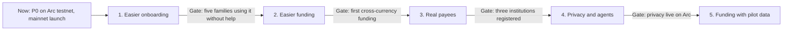

| Stage | Scope | Gate |
| --- | --- | --- |
| **1. Easier onboarding** | Passkey wallets for family members; SMS or WhatsApp alerts for senders; request expiry | Five families using Earmark without help |
| **2. Easier funding** | App Kit on-ramp by card; EURC or GBP senders through App Kit swaps | The first cross-currency funding |
| **3. Real payees** | A registry of schools, landlords and traders that accept USDC or work with a local off-ramp | Three institutions registered |
| **4. Privacy and agents** | Adopt Arc's opt-in privacy when it ships; allow an AI bill-pay agent as a spender under the same caps | Privacy feature live on Arc |
| **5. Funding** | Apply to the Circle Grant Program with pilot data | Stage 3 reached |

### Pilot success metrics

| Metric | Target |
| --- | --- |
| Sender and family pairs using Earmark | 10 to 20 |
| Share of payments made within the rules (no request needed) | Tracked monthly |
| Change in monthly amount sent against each sender's prior 3 months | Tracked, compared with the 15% J-PAL result |
| Sender trust score in a short survey (1 to 5) | 4 or higher |

### Candidate P1 items

Payee and limit editing screens, a cancel-request screen, a share QR code, and CSV export of a pocket's activity. They wait until the testnet rehearsal passes and the product owner approves them.

---

## Repository layout

```text
CLAUDE.md, AGENTS.md          standing rules (identical)
LICENSE                       MIT
contracts/                    Foundry project
  src/EarmarkPockets.sol
  test/                       unit, fuzz, invariant/ (Handler, Invariants), mocks/, GasWorstCase
  script/                     Deploy.s.sol, export-abi.mjs
web/                          Vite + React + TypeScript
  src/chains.ts config.ts abi.ts copy.ts
  src/lib/                    amounts, tx, gas, errors, activity, rates, ...
  src/data/                   reads, live feed, hooks
  src/pages/, src/components/
  src/ds/                     copied design-system source
  src/styles/                 tokens.css, earmark.css, app.css, motion.css
  e2e/                        headless-Chrome rehearsal and checks
  public/                     fonts, icons, manifest, share image
  vercel.json                 headers and caching
scripts/local-chain.sh        local rehearsal chain
deployments/                  arc-testnet.json (arc-mainnet.json at launch)
docs/                         PRD, PROGRESS, DECISIONS, FRICTION-LOG, SECURITY, GAS,
                              DEPLOY, REHEARSAL, SUBMISSION, DEMO-SCRIPT, images/
design-system/                the Earmark design system (source; not shipped as-is)
notes/                        private working notes, git-ignored
```

---

## Documentation index

| Document | Contents |
| --- | --- |
| [`docs/PRD.md`](docs/PRD.md) | Product requirements: behaviour, contract specification, Arc requirements, tests, deployment, repository layout |
| [`docs/DECISIONS.md`](docs/DECISIONS.md) | Decisions D1 to D13 and every logged conflict. Overrides other documents |
| [`docs/PROGRESS.md`](docs/PROGRESS.md) | Phase-by-phase progress and checkpoints |
| [`docs/SECURITY.md`](docs/SECURITY.md) | Design, invariants, test evidence, Slither triage, known limitations |
| [`docs/GAS.md`](docs/GAS.md) | Gas measurements and fallback limits |
| [`docs/FRICTION-LOG.md`](docs/FRICTION-LOG.md) | Every Arc-specific snag, with cause and fix |
| [`docs/DEPLOY.md`](docs/DEPLOY.md) | Testnet and mainnet deploy, hosting, verification |
| [`docs/REHEARSAL.md`](docs/REHEARSAL.md) | The testnet rehearsal checklist |
| [`docs/SUBMISSION.md`](docs/SUBMISSION.md), [`docs/DEMO-SCRIPT.md`](docs/DEMO-SCRIPT.md) | Submission text and demo video script |
| [`design-system/`](design-system/) | Tokens, components, content, responsive, patterns, accessibility |

---

## Contributing

Contributions are welcome once the launch phase is complete. Until then, scope is deliberately tight.

1. **Read the sources of truth first**, in this order: `docs/DECISIONS.md`, `docs/PRD.md`, `design-system/`.
2. **Stay in scope.** P0 only. No P1 item ships until the testnet rehearsal passes and the product owner approves it.
3. **Keep the rules.**
   - Never include a private key, seed phrase or `.env` file. Run `git status` before every commit.
   - The contract keeps its guarantees: no owner, admin, pause, upgrade, `delegatecall`, `selfdestruct`, `payable` or `receive()`. Every write is `nonReentrant` and moves USDC only through `SafeERC20`.
   - USDC approvals are for the exact amount only.
   - UI words: never "gas", "transaction", "hash", "mainnet", "sponsor" or "spender". Use the word list in `design-system/guidelines/10-content.md`.
   - Plain CSS with design-system tokens and `ek-` classes only. No other UI kit or icon set. No hard-coded colours or font sizes.
   - USDC stays `bigint` until the component boundary.
4. **Meet the quality bar.** TypeScript strict, no `any` in app code, no console errors or warnings, bundle under 300 KB gzipped, Lighthouse accessibility 90 or more.
5. **Run the checks** before opening a pull request:

   ```bash
   cd contracts && forge test && forge coverage --report summary && slither .
   cd ../web && npm run typecheck && npm run lint && npm test && npm run build
   ```

6. **Open a pull request** that explains what changed and why, links the decision it relies on, and states which checks you ran.

Be kind and constructive in issues and reviews. Harassment and discrimination are not tolerated.

---

## FAQ

**Is Earmark a bank or a custodian?**
No. It is non-custodial software. The builder holds no funds, charges no fees and handles no fiat. Any production service would need legal advice in each market; this is not legal advice.

**Who accepts USDC in Nigeria today?**
A payee can be any wallet, including an exchange deposit address for cash-out. The research shows the label does most of the work, and payee-only pockets are an optional hard rule for schools or landlords that accept USDC.

**Isn't this just a multisig allowance?**
A multisig controls who signs. Earmark controls what money is *for*, who may add to it, when it may be reclaimed, and it keeps the family member's fees covered from the same USDC.

**Why Arc and not another chain?**
USDC as the fee token makes the self-funding fee credit possible; deterministic finality makes the live feed trustworthy; and Circle's roadmap for Arc (App Kits, wallets, privacy) is the path to production.

**What if the family member loses their phone?**
Whoever holds that wallet's key can spend within the rules. The limit, payee list and lock bound the damage. The sender can lower the limit, remove payees, and withdraw unspent money once any lock ends. Passkey wallets are on the roadmap.

**Can the sender really not withdraw during a lock?**
Correct. The contract refuses a withdrawal before the lock date. The lock can only be moved later. This is a commitment device the sender chooses for themselves.

**Can I lose money by sending USDC straight to the contract address?**
Yes. Only money added through `fund` or `createPocket` is credited. There is no admin to recover other transfers. Always use the app.

**Does the app work offline or without the rate service?**
It needs the Arc RPC. If the naira rate service is down, the naira figures hide and everything else works.

**Why can't I see my wallet's fee token?**
Some wallets show the USDC balance as "ETH" or with the wrong decimals on Arc. The app shows its own correct figures.

**Is it audited?**
No. It has 100% line and branch coverage, fuzz and invariant tests, and a Slither review with no high or medium findings, but it is unaudited. Use small amounts.

**Are there fees for using Earmark?**
Earmark charges none. You pay only Arc's network fee, in USDC, which is a fraction of a cent for common actions.

---

## Glossary

| Term | Meaning in Earmark |
| --- | --- |
| **Pocket** | A labelled balance of USDC with its own rules |
| **Sender (sponsor)** | The person who created the pocket and controls its rules |
| **Family member (spender)** | The person allowed to pay from the pocket |
| **Co-funder** | Anyone else who adds money to a pocket |
| **Payee** | An approved recipient. A payee-only pocket pays only these |
| **Allowance (limit per period)** | The most a family member can spend within the rules per period |
| **Period** | The window (1 to 31 days, default 7) in which the allowance applies |
| **Request** | A payment above the rules that the sender approves or declines |
| **Commitment lock** | A date before which the sender cannot withdraw. It can only move later |
| **Fee credit** | A few cents of USDC the pocket keeps in the family member's wallet for network fees (called the "fuel" in the contract) |
| **Back-pointer (`prevEventBlock`)** | The block of a pocket's previous event, used to rebuild history without an indexer |
| **Deterministic finality** | A payment is final as soon as it is in a block |
| **USDC** | A dollar-pegged stablecoin; on Arc it is also the fee token |
| **Purpose Bound Money (PBM)** | The Monetary Authority of Singapore's model of wrapping money with purpose rules without changing the money itself |
| **Arc** | Circle's EVM-compatible network where USDC is the native fee token |

---

## Acknowledgements

- The **Monetary Authority of Singapore** for the Purpose Bound Money model.
- **J-PAL** and the authors of the Rome remittance field experiment for the evidence behind labels.
- **Circle** and the **Arc** team, whose open issues and documentation informed the [friction log](docs/FRICTION-LOG.md).
- **OpenZeppelin** (Contracts 5.x), **Foundry**, **Slither**, **viem**, **wagmi**, **TanStack Query**, **React**, **Vite** and **Vitest**.
- **Phosphor Icons** (MIT) and the font families used under the SIL Open Font License.

---

## References

Abdul Latif Jameel Poverty Action Lab. (n.d.). *Testing commitment devices for remittances among Filipino migrants in Rome*. Retrieved September 27, 2026, from https://www.povertyactionlab.org/evaluation/testing-commitment-devices-remittances-among-filipino-migrants-rome

Arc Network Services LLC. (n.d.-a). *Connect to Arc*. Arc Docs. Retrieved September 28, 2026, from https://docs.arc.io/arc/references/connect-to-arc

Arc Network Services LLC. (n.d.-b). *EVM differences*. Arc Docs. Retrieved September 28, 2026, from https://docs.arc.io/arc/references/evm-differences

Arc Network Services LLC. (n.d.-c). *Gas and fees*. Arc Docs. Retrieved September 28, 2026, from https://docs.arc.io/arc/references/gas-and-fees

circlefin. (n.d.). *[Issue #80 on eth_estimateGas failures for USDC write transactions]* [GitHub issue]. GitHub. https://github.com/circlefin/arc-node/issues/80

De Arcangelis, G., Joxhe, M., McKenzie, D., Tiongson, E., & Yang, D. (2015). Directing remittances to education with soft and hard commitments: Evidence from a lab-in-the-field experiment and new product take-up among Filipino migrants in Rome. *Journal of Economic Behavior & Organization, 111*, 197–208. https://doi.org/10.1016/j.jebo.2014.12.025

Monetary Authority of Singapore. (2023). *Purpose bound money (PBM) technical whitepaper*. https://www.mas.gov.sg/-/media/mas-media-library/development/fintech/pbm/pbm-technical-whitepaper.pdf

Team Arc. (2026, September 16). *The unfinished business of finance, machine commerce, and global money: A request for builders*. Arc. https://www.arc.io/blog/the-unfinished-business-of-finance-machine-commerce-and-global-money

United Nations Department of Economic and Social Affairs. (2025). *World economic situation and prospects: November 2025 briefing, no. 196*. https://policy.desa.un.org/publications/world-economic-situation-and-prospects-november-2025-briefing-no-196

Vanguard. (2026, May). *Diaspora remittances stabilises at $21.8bn in 2025 amid global pressures*. https://www.vanguardngr.com/2026/05/diaspora-remittances-stabilises-at-21-8bn-in-2025-amid-global-pressures/

---

## License

Released under the **MIT License**. Copyright (c) 2026 Earmark contributors. See [`LICENSE`](LICENSE) for the full text.

```text
MIT License

Copyright (c) 2026 Earmark contributors

Permission is hereby granted, free of charge, to any person obtaining a copy
of this software and associated documentation files (the "Software"), to deal
in the Software without restriction, including without limitation the rights
to use, copy, modify, merge, publish, distribute, sublicense, and/or sell
copies of the Software, and to permit persons to whom the Software is
furnished to do so, subject to the following conditions:

The above copyright notice and this permission notice shall be included in all
copies or substantial portions of the Software.

THE SOFTWARE IS PROVIDED "AS IS", WITHOUT WARRANTY OF ANY KIND, EXPRESS OR
IMPLIED, INCLUDING BUT NOT LIMITED TO THE WARRANTIES OF MERCHANTABILITY,
FITNESS FOR A PARTICULAR PURPOSE AND NONINFRINGEMENT. IN NO EVENT SHALL THE
AUTHORS OR COPYRIGHT HOLDERS BE LIABLE FOR ANY CLAIM, DAMAGES OR OTHER
LIABILITY, WHETHER IN AN ACTION OF CONTRACT, TORT OR OTHERWISE, ARISING FROM,
OUT OF OR IN CONNECTION WITH THE SOFTWARE OR THE USE OR OTHER DEALINGS IN THE
SOFTWARE.
```

Fonts are under the SIL Open Font License and Phosphor Icons under MIT (`web/public/fonts/licenses/`).

<div align="center">

**Earmark: money sent home, with a purpose.**

</div>
